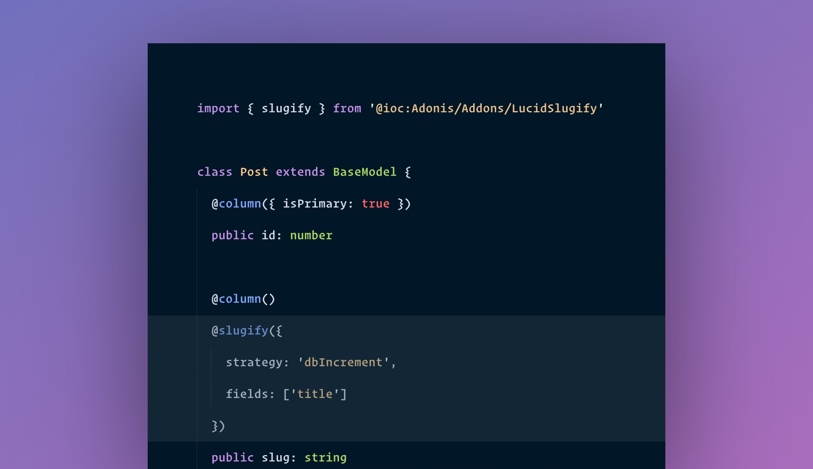

# Lucid Slugify

<div align="center">
  
</div>

---

[![gh-workflow-image]][gh-workflow-url] [![npm-image]][npm-url] [![license-image]][license-url] [![typescript-image]][typescript-url]

Generating slugs is easy, but keeping them unique and within a maximum length range is hard. This package abstracts the hard parts and gives you a simple API to generate unique slugs.

<!-- START doctoc generated TOC please keep comment here to allow auto update -->
<!-- DON'T EDIT THIS SECTION, INSTEAD RE-RUN doctoc TO UPDATE -->

<!-- END doctoc generated TOC please keep comment here to allow auto update -->

## Features

- Define a maximum length for the slug
- Complete words when truncating the slug
- Generate unique slugs using different strategies
- Add your custom strategies

## Usage
Install and configure the package as follows:

```sh
node ace add @adonisjs/lucid-slugify
```

Once done, you need to use the following decorator on the field for which you want to generate the slug. Following is an example with the `Post` model generating slug from the **post title**.

```ts
import { BaseModel, column } from '@adonisjs/lucid/orm'
import slugify from '@adonisjs/lucid-slugify/decorator'

class Post extends BaseModel {
  @column({ isPrimary: true })
  public id: number

  @column()
  @slugify({
    strategy: 'dbIncrement',
    fields: ['title']
  })
  public slug: string

  @column()
  public title: string
}
```

In the above example, the `slug` property will be set based upon the value of the `title` property.

## Updating slugs
By default, slugs are not updated when you update a model instance, and this is how it should be when slugs are used to look up a record, as changing a slug will result in a broken URL.

However, if slugs are not primarily used to look up records, you may want to update them.

You can enable updates by using the `allowUpdates` flag.

```ts
@slugify({
  strategy: 'dbIncrement',
  fields: ['title'],
  allowUpdates: true,
})
public slug: string
```


## Generate slug from multiple properties

The `fields` array can accept multiple model properties and generate a slug by concatenating the values of all the fields.

```ts
@slugify({
  strategy: 'dbIncrement',
  fields: ['country', 'state', 'city'],
  allowUpdates: true,
})
public location: string
```

## Null values and slug generation

The `slugify` decorator does not generate slugs when the source field(s) value is not defined or null.

In other words, all of the source fields should have a value for the slug to be generated. **It is an opinionated choice and not likely to change**.

## Available options

Following is the list of available options accepted by the `@slugify` decorator.

<table>
<tr>
  <td colspan="2"><code>{</code></td>
</tr>
<tr>
  <td valign="top"><code>"fields":</code></td>
  <td>
    <p>
    An array of source fields to use for generating the slug. The value of multiple fields is concatenated using the <code>config.separator</code> property.
    </p>
  </td>
</tr>
<tr>
  <td valign="top"><code>"strategy":</code></td>
  <td>
    <p>
    Reference to pre-existing strategy or an object with the <code>makeSlug</code> and <code>makeSlugUnique</code> methods.
    </p>
  </td>
</tr>
<tr>
  <td valign="top"><code>"allowUpdates":</code></td>
  <td>
    <p>
    A boolean to enable updates. <strong>Updates are disabled by default</strong>.
    </p>
  </td>
</tr>
<tr>
  <td valign="top"><code>"maxLength":</code></td>
  <td>
    <p>
    The maximum length for the generated slug. The final slug value can be slightly over the defined <code>maxLength</code> in following scenarios.
    </p>
    <p>
      <strong>No max length is applied by default.</strong>
    </p>
  <ul>
  <li>
    When <code>completeWords</code> is set to true.
  </li>
  <li>
    When using the <code>dbIncrement</code> strategy. The counter value is appended after trimming the value for the <code>maxLength</code>.
  </li>
  </ul>
  </td>
</tr>
<tr>
  <td valign="top"><code>"completeWords":</code></td>
  <td>
    <p>
    A boolean that forces to complete the words when applying the <code>maxLength</code> property. Completing words will generate a slug larger than the <code>maxLength</code>. So make sure to keep some buffer between the maxLength property and the database storage size.
    </p>
    <p>
      <strong>Complete words is disabled by default.</strong>
    </p>
  </td>
</tr>
<tr>
  <td valign="top"><code>"separator":</code></td>
  <td>
    <p>
    The separator to use for creating the slug. <strong>A dash <code>-</code> is used by default.</strong>
    </p>
  </td>
</tr>
<tr>
  <td valign="top"><code>"transformer":</code></td>
  <td>
    <p>
    A custom function to convert non-string data types to a string value. For example, if the source field from which slug is generated is a boolean, then we will convert it to <code>"1"</code> or <code>"0"</code>.
    </p>
    <p>
    By defining the <code>transformer</code> property you can decide how different data types can be converted to a string.
    </p>
  </td>
</tr>
<tr>
  <td colspan="2"><code>}</code></td>
</tr>
</table>

## Strategies

Strategies decide how to generate a slug and then make it unique. This package ships with three different strategies.

- **simple**: Just the slug is generated. No uniqueness guaranteed.
- **dbIncrement**: Generates unique slugs by adding a counter to the existing similar slug.
- **shortId**: Appends a short id to the initial slug value to ensure uniqueness. 

### Db Increment

The Db Increment strategy uses a counter to generate unique slugs. Given the following table structure and data.

```
+----+-------------+-------------+
| id | title       | slug        |
+----+-------------+-------------+
| 1  | Hello world | hello-world |
+----+-------------+-------------+
```

If you generate another slug for the **Hello world** title, the `dbIncrement` strategy will append `-1` to ensure slug uniqueness.

#### Model definition
```ts
import { BaseModel, column } from '@adonisjs/lucid/orm'
import slugify from '@adonisjs/lucid-slugify/decorator'

class Post extends BaseModel {
  @column({ isPrimary: true })
  public id: number

  @column()
  @slugify({
    strategy: 'dbIncrement',
    fields: ['title']
  })
  public slug: string

  @column()
  public title: string
}
```

#### Create a new record
```ts
const post = new Post()
post.title = 'Hello world'

await post.save()
```

#### Database state
```
+----+-------------+---------------+
| id | title       | slug          |
+----+-------------+---------------+
| 1  | Hello world | hello-world   |
| 2  | Hello world | hello-world-1 |
+----+-------------+---------------+
```

#### Implementation details

The implementation details vary a lot across different database drivers.

- **PostgreSQL, MsSQL 8.0, and Redshift** performs optimized queries to fetch only matching record with the largest counter.
- For **SQLite, MySQL < 8.0, and MSSQL**, we have to fetch all the matching rows and then find the largest counter in JavaScript.
- The **OracleDB** implementation is untested (feel free to contribute the tests). However, it also performs an optimized query to fetch only matching records with the largest counter.

### Simple

The `simple` strategy just generates a slug respecting the `maxLength` and `completeWords` config options. No uniqueness is guaranteed when using this strategy.

```ts
import { BaseModel, column } from '@adonisjs/lucid/orm'
import slugify from '@adonisjs/lucid-slugify/decorator'

class Post extends BaseModel {
  @column({ isPrimary: true })
  public id: number

  @column()
  @slugify({
    strategy: 'simple',
    fields: ['title']
  })
  public slug: string

  @column()
  public title: string
}
```

### Short Id

The `shortId` strategy **appends a ten-digit long random short id** to the initial slug value for uniqueness. Following is an example of using the `shortId` strategy.

```ts
import { BaseModel, column } from '@adonisjs/lucid/orm'
import slugify from '@adonisjs/lucid-slugify/decorator'

class Post extends BaseModel {
  @column({ isPrimary: true })
  public id: number

  @column()
  @slugify({
    strategy: 'shortId',
    fields: ['title']
  })
  public slug: string

  @column()
  public title: string
}
```

```
+----+-------------+------------------------+
| id | title       | slug                   |
+----+-------------+------------------------+
| 1  | Hello world | hello-world-yRPZZIWGgC |
+----+-------------+------------------------+
```

## Adding a custom strategy

You can add custom strategies using two different ways.

### Inline within the `slugify` decorator
The simplest way is to define the strategy inline in the decorator options. A strategy must implement the following two methods.

```ts
import { SlugifyStrategy } from '@adonisjs/lucid-slugify/types

const myCustomStrategy: SlugifyStrategy = {
  makeSlug (model, field, value) {
    return // slug for the value
  },
  makeSlugUnique(model, field, slug) {
    return // make slug unique
  },
}

@slugify({
  strategy: myCustomStrategy,
  fields: ['title']
})
```

### Extending the `slugify` package
This is the recommended approach when you are distributing your strategy as an npm package. Every strategy must implement the `SlugifyStrategy` interface.

#### Define strategy

```ts
import {
  SlugifyConfig,
  SlugifyStrategy
} from '@adonisjs/lucid-slugify/types'

class MyStrategy implements SlugifyStrategy {
  constructor (private config: SlugifyConfig) {}

  makeSlug (
    model: LucidModel,
    field: string,
    value: string
  ) {}

  makeSlugUnique (
    model: LucidModel,
    field: string,
    slug: string
  ) {}
}
```

#### Register the strategy
Register the strategy using the `slugify.extend` method. You must write the following code inside the provider `boot` method.

```ts
import type { ApplicationService } from '@adonisjs/core/types'

export default class AppProvider {
  constructor(protected app: ApplicationService) {}

  public async boot() {
    const slugify = await this.app.container.make('slugify.manager')

    slugify.extend('strategyName', (slugify, config) => {
      return new MyStrategy(config)
    })
  }
}
```

#### Inform typescript about the strategy
Finally, you will also have to inform typescript about the new strategy you added using the `slugify.extend` method. We will use [declaration merging](https://www.typescriptlang.org/docs/handbook/declaration-merging.html#merging-interfaces) to add the property to the `StrategiesList` interface.

```ts
declare module '@adonisjs/lucid-slugify/types' {
  interface StrategiesList {
    strategyName: SlugifyStrategy
  }
}
```

[gh-workflow-image]: https://img.shields.io/github/workflow/status/adonisjs/lucid-slugify/test?style=for-the-badge
[gh-workflow-url]: https://github.com/adonisjs/lucid-slugify/actions/workflows/test.yml "Github action"

[npm-image]: https://img.shields.io/npm/v/@adonisjs/lucid-slugify.svg?style=for-the-badge&logo=npm
[npm-url]: https://npmjs.org/package/@adonisjs/lucid-slugify "npm"

[license-image]: https://img.shields.io/npm/l/@adonisjs/lucid-slugify?color=blueviolet&style=for-the-badge
[license-url]: LICENSE.md "license"

[typescript-image]: https://img.shields.io/badge/Typescript-294E80.svg?style=for-the-badge&logo=typescript
[typescript-url]:  "typescript"
